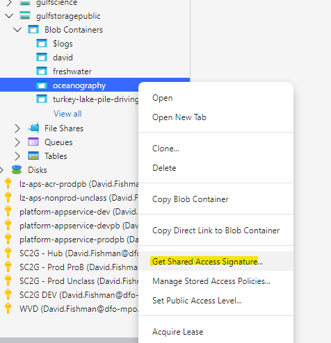
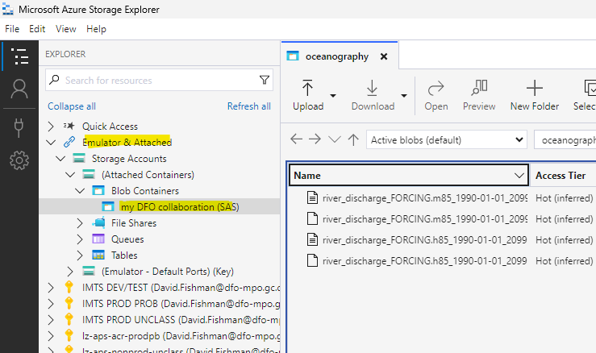

# Azure Blob Storage Services Cheatsheet

## Steps for DFO Employees

1. Before being able to access the storage account, the employee will have to be added to the [Gulf Science (Storage)](https://portal.azure.com/#view/Microsoft_AAD_IAM/GroupDetailsMenuBlade/~/Overview/groupId/1d0d3d2f-c487-4d16-b38e-15ce44918959/menuId/) security group. Please contact the any member of the CADI Team to have this done.

2. Download **Microsoft Azure Storage Explorer**. This can be downloaded through the [DFO Software Centre](softwarecenter:SoftwareID=ScopeId_A90E3BBE-DB35-4A92-A44E-15F8C7C595B3/Application_61c85969-b0b5-4e54-8eb1-26a88035a8ca) or directly from [the internet](https://azure.microsoft.com/en-us/products/storage/storage-explorer/) (will require elevated system permissions).

3. Open the storage explore and sign in using your DFO Cloud credentials. You know you have successfully signed in when you can see the your list of subscriptions, as shown below.

 

4. Next, click on the Explorer button at the top left. Then you should see a list of all the storage accounts to which you have access. The public-facing storage account is called `gulfstoragepublic` and is under the `IMTS PROD UNCLASS` subscription.

5. When you go to expand the `gulfstoragepublic` account, you will see a list of the containers. You can think of these containers as folders.

6. When you click on a container, a window will open up to the right displaying all your files. From here you should be good to go.

### **NOTE:** Just make sure you only interact with the containers that belong to you.  This is a similar principal as with working on the DFO shared drives. 

7. You can create new containers by right-clicking on the `Blob Containers` heading, under the `gulfstoragepublic` account.

## Steps for sharing FILES with external collaborators

1. right-click on the file you want to share and select **Get Shared Access Signature** (SAS) 

2. Configure the SAS by setting an appropriate expiration time and permissions. When sharing files, all you need to have is `Read` permission. The click on **Create**. 

3. Finally, copy the shareable link in the top box. This link can now be used by the external collaborator for downloading the file.

## Steps for sharing CONTAINERS with external collaborators

### Your part:

1. Just like in the steps above, we will generate a SAS, but this time for a whole container:

2. Configure the SAS by setting an appropriate expiration time and permissions. When sharing access to a container, you'll probably want to add a few extra permissions, as displayed below. The click on **Create**. 

3. copy the URL and send it to the collaborator

### Their part

1. The collaborator will need to first download **Microsoft Azure Storage Explorer** from [the internet](https://azure.microsoft.com/en-us/products/storage/storage-explorer/), assuming they do not already have it. 

2. Once installed, they need to click on the Plug icon on the left-hand side and then select **Blob container or directory**

3. they must then select the middle option, **Shared access signature URL (SAS)**, then click **next**.

4. Finally, they can give the container a name, paste in the URL and click **next** and then **connect** (on the following page, not shown).

Now they should be able to see the shared container in their explorer under the `Emulator & Attached` section.

