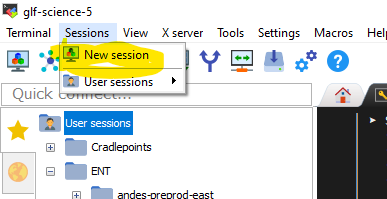
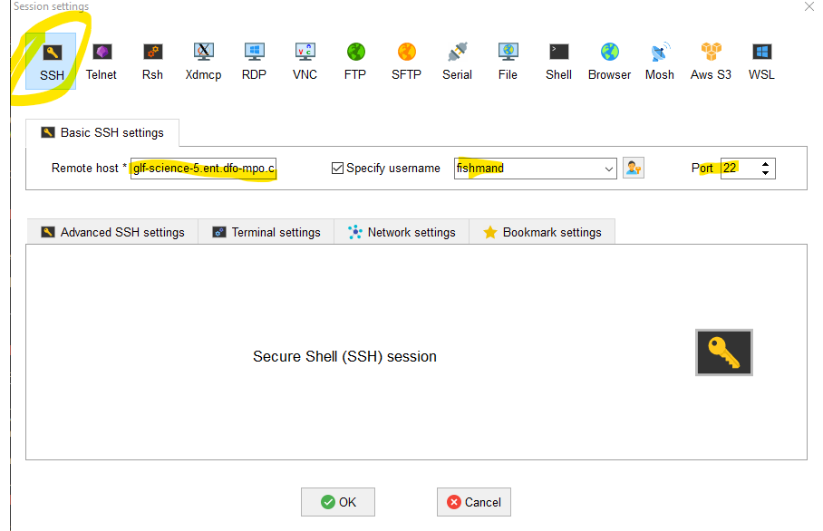
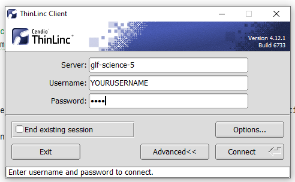
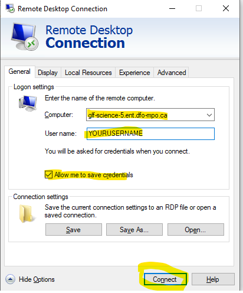
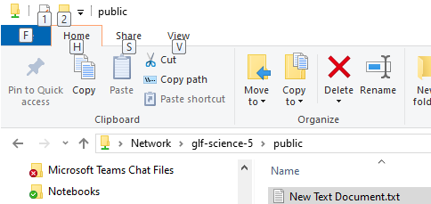
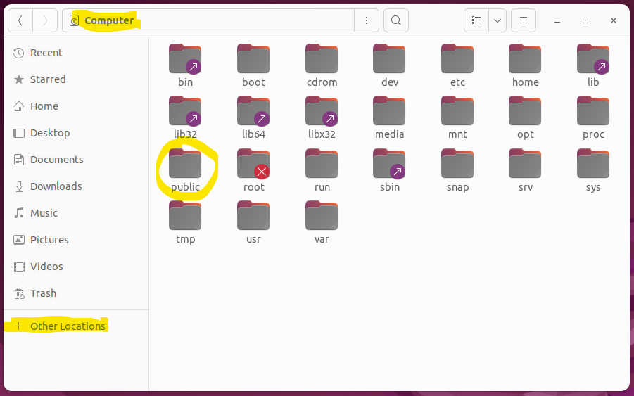
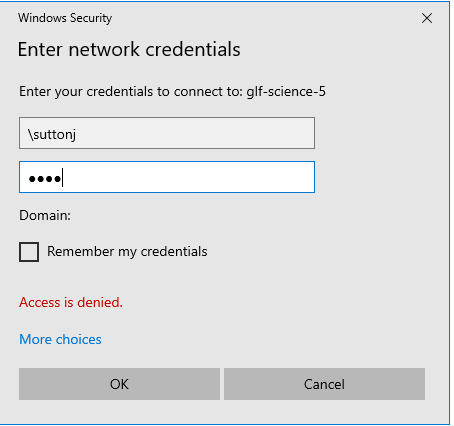

# Cheatsheet for CDOS Ubuntu 22.04 Linux Desktop 

## How to get an account?

Contact Quentin or David. They will create a user for you.

## How do I log in?

### 1. Command Line Interface (CLI)

####  Windows Command Prompt / Powershell
- Open a terminal with Windows `Command Prompt` or `Powershell`
- type the following command `ssh myusername@glf-science-cadi.ent.dfo-mpo.ca` followed by `yes` and then your password.

#### SSH with MobaXterm (this tool is great)

- Download MobaXterm: [https://mobaxterm.mobatek.net/](https://mobaxterm.mobatek.net/)

- Create a new session



- Enter the following information



- The new session will be saved and can be accessed by the sessions sidebar
- MobaXterm supports X11 forwarding so you can do neat things such as typing in `rstudio` in the command line and the program will open up for you in Windows

### 2. Remote Desktop / GUI

#### ThinLinc (Preferred):

- from the DFO Software Center, look for and download `ThinLinc`


- Open the client and simply enter your credentials:



- You can use the `F8` key to play around with the display settings, e.g. full screen mode
- If you close the window without logging out first, your user will still be logged in. In other words, closing the terminal on the Windows side does not log you out. 


#### Windows Remote Desktop Connection Tool (Alternate):

- This is not an ideal tool to use since your environment variables will not get properly loaded and the performance over VPN is horrible.
- In windows, search for `Remote Desktop Connection`. Open the app.
- Computer = `glf-science-cadi.ent.dfo-mpo.ca`
- User name = `YOURUSERNAME` (e.g., fishmand)



## Who else is currently logged into the linux box?

Open up a terminal (`Ctrl` + `Alt` + `T`) and type the following: `w`


## How can I copy files from my DFO computer to the linux computer

##### 1) Public share

- from your DFO computer open up a file explorer window and put in the following address: `\\glf-science-cadi\public`



- Move in any files you want to transfer over into this share
- On the linux side, this folder can be found here `/public`. You can access it using the file explore as well



- It is a good idea to not leave stuff in this folder since it is a public folder and is accessible by essentially anyone on the DFO network

##### 2) Access your linux home directory via windows
 
- from your DFO computer open up a file explorer window and put in the following address: `\\glf-science-cadi\MY_USER_NAME`.
- An authentication screen should pop up and enter your username (with a backslash in front) and password



**NOTE:** A system administrator will need to get you set up the first time in order to use this feature.

## Installing a Specific R Version (SUDO privileges required)
from [here](https://docs.posit.co/resources/install-r/#specify-r-version)

```bash
R_VERSION=4.4.3
curl -O https://cdn.rstudio.com/r/ubuntu-2204/pkgs/r-${R_VERSION}_1_amd64.deb
sudo apt install ./r-${R_VERSION}_1_amd64.deb
sudo ln -s /opt/R/${R_VERSION}/bin/R /usr/local/bin/R${R_VERSION}
sudo ln -s /opt/R/${R_VERSION}/bin/Rscript /usr/local/bin/Rscript${R_VERSION}
```

From a terminal, you can open up a console by typing `R${R_VERSION}`, (e.g. `R4.3.2`) followed by `enter`.

## How to point R Studio to a different R Version

In linux when r studio opens up, it will load the version of R that is pointed to by the environmental variable called 
`RSTUDIO_WHICH_R` or to the path as specified by `which R`.
If both of these are empty, R studio will not load.

To point your profile's R Studio to a different version of R, do the following:

- Make sure the version you want to use is actually installed (see above)
- Open up a terminal (`Ctrl` + `Alt` + `T`) and type the following: `nano ~/.profile`
- Update the following line: `export RSTUDIO_WHICH_R=/opt/R/x.x.x/bin/R` where `x.x.x` is the version you want to be using
- Log out and log back in.


**Note to the geeks**: There is a complication when accessing ubuntu desktop via windows remote connection. The .profile file is not sourced / re-sourced.  

## ADMB

- We installed ADMB 13.1 at the system level under the `opt` directory
- There is a symlink to the admb executable which was placed in `/usr/local/bin` and therefore the `admb` command should be available from anywhere in the terminal. 
- If in the future we need to install different versions of ADMB, we should reassign the symlink to contain the version, e.g. `admb13.1`