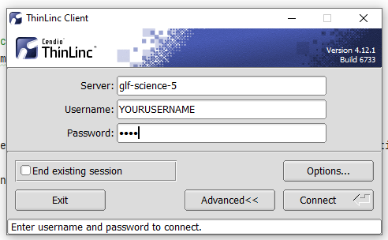
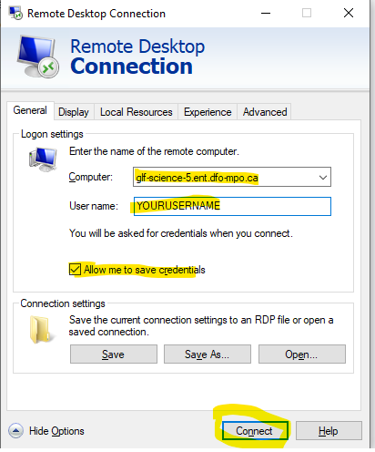
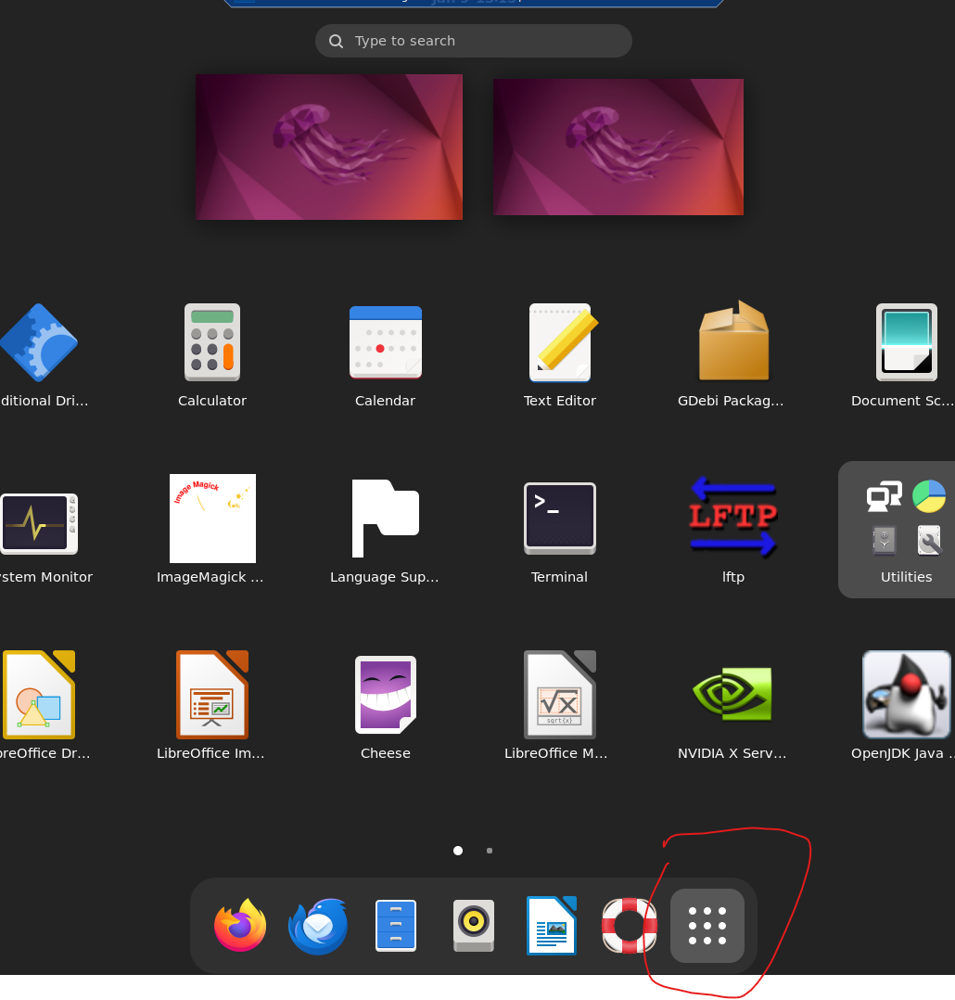

# Cheatsheet for CDOS Ubuntu 22.04 Linux Desktop 

### How to get an account?

Contact Quentin or David. They will create a user for you.

### How do I log in?

#### ThinLinc (Preferred):

- from the DFO Software Center, look for and download `ThinLinc`


- Open the client and simply enter your credentials:



- You can use the `F8` key to play around with the display settings, e.g. full screen mode


#### Windows Remote Desktop Connection Tool (Alternate):

- In windows, search for `Remote Desktop Connection`. Open the app.
- Computer = `glf-science-5.ent.dfo-mpo.ca`
- User name = `YOURUSERNAME` (e.g., fishmand)



### How do I find an application?
- Click on the "Activities" button at the top left or press the "windows" key to open up the application search.
- You can also click on the "grid" button



### Installing a Specific R Version (SUDO privileges required)
from [here](https://docs.posit.co/resources/install-r/#specify-r-version)

```bash
R_VERSION=4.2.3
curl -O https://cdn.rstudio.com/r/ubuntu-2204/pkgs/r-${R_VERSION}_1_amd64.deb
sudo gdebi r-${R_VERSION}_1_amd64.deb
sudo ln -s /opt/R/${R_VERSION}/bin/R /usr/local/bin/R${R_VERSION}
sudo ln -s /opt/R/${R_VERSION}/bin/Rscript /usr/local/bin/Rscript${R_VERSION}
```

From a terminal, you can open up a console by typing `R${R_VERSION}`, (e.g. `R4.3.2`) followed by `enter`.

### How to point R Studio to a different R Version

In linux when r studio opens up, it will load the version of R that is pointed to by the environmental variable called `RSTUDIO_WHICH_R` or to the path as specified by `which R`.
If both of these are empty, R studio will not load.

To point your profile's R Studio to a different version of R, do the following:

- Make sure the version you want to use is actually installed (see above)
- Open up a terminal (`Ctrl` + `Alt` + `T`) and type the following: `nano ~/.profile`
- Update the following line: `export RSTUDIO_WHICH_R=/opt/R/x.x.x/bin/R` where `x.x.x` is the version you want to be using
- Log out and log back in.


**Note to the geeks**: There is a complication when accessing ubuntu desktop via windows remote connection. The .profile file is not sourced / re-sourced.  


### ADMB

- We installed ADMB 13.1 at the system level under the `opt` directory
- There is a symlink to the admb executable which was placed in `/usr/local/bin` and therefore the `admb` command should be available from anywhere in the terminal. 
- If in the future we need to install different versions of ADMB, we should reassign the symlink to contain the version, e.g. `admb13.1`